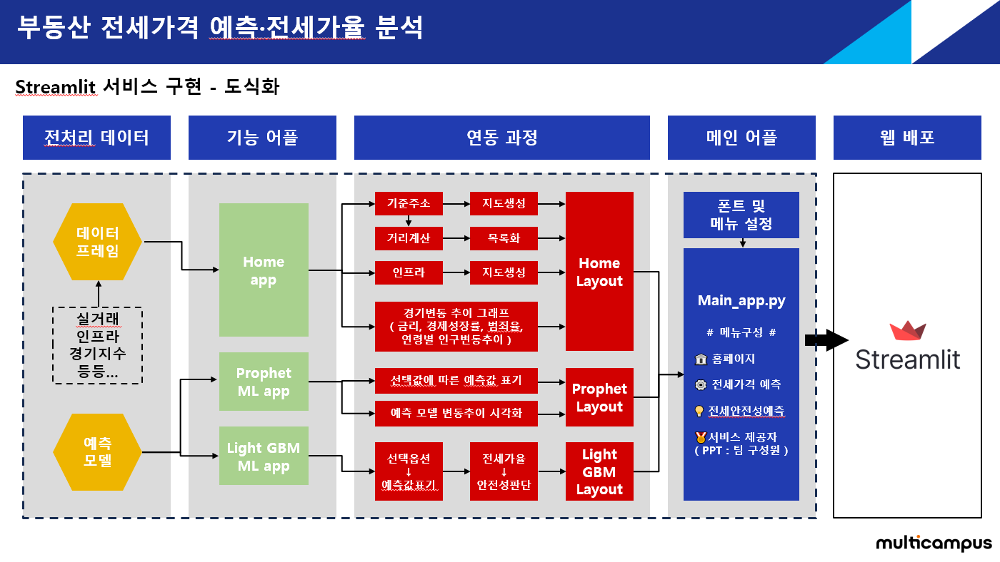

# 프로젝트 : 부동산 전세가격 예측 및 전세가율 분석
### 적정 전세가율을 활용한 전세사기 예방 웹사이트 구축
- - -
### 프로젝트 개요
    * 주제 선정 배경 : 최근 전세 사기가 급증함에 따라 사회적 불안이 증가하고 사회 초년생에게는  전세 사고 또는 사기가 치명적이기에 우리는 안정적인 전세 매물을 확인할 수 있는 예측 모델을 통해 웹으로 제공함으로써 사회적 기여를 하고 싶었다.

    * 프로젝트 수행 방향 : 
    수집한 데이터를 EDA하여 미래의 매매가격을 예측.
    적정 전세가율을 활용하여 계약할 전세 가격의 안전성을 평가하여 전세 사기를 방지하는게 목적이다.

    * 수집 데이터 목록 : 부동산 관련 시계열 데이터, 위치 데이터
        - 금리
        - 실업률
        - 서울특별시 전세 실거래 데이터
        - 서울특별시 매매 실거래 데이터
        - 지하철
        - 학군 : 초/중/고등학교 위치 데이터
        - 공원 위치 데이터
        - 대학교 위치 데이터
        - 지하철 위치 데이터
        - 경기종합지수
        - 주택 재개발
        - 매매가격지수

- - -
### 프로젝트 수행 과정
    * 데이터 전처리 :
        - 시계열 데이터 : 금리, 실업률, 전세/매매 실거래, 경기종합지수, 주택 재개발, 매매가격지수
            + 시계열 데이터 특성 :
            각 데이터들의 시계열 간격이 다르므로 취합할 때 어떤 데이터의 시계열 간격으로
            맞춰야할 지 팀원들끼리 많은 고민을 하였다.

            일별, 월별, 분기별, 년도별 간격이 있었는데 월별 간격이 다른 간격에 비해
            변동폭이 우리나라의 부동산 정보를 대표 해주는 것이라 생각해 채택하게 되었다.

        - 위치 데이터 : 학군, 공원, 대학교, 지하철
            + 위치 데이터 활용 :
            위치 데이터는 예측할 부동산의 최단거리 계산을 통해 연관성을 파악해
            학습 모델의 정확도를 높히기 위해 최단거리를 피처로 넣게 되었다.
        
        - 결측치 처리 : 각 컬럼에 대한 결측치 처리 방식
            + 기준 금리 : 실거래 데이터가 가장 최신 데이터이다 보니 최근 기준 금리 값으로 반영
            + 실업률, 경기지수, 전세수급동향지수 : XGBoost 활용하여 결측치 예측값으로 대체

    * EDA 과정 : 시각화와 데이터간의 연관성을 파악하여 인사이트 도출
        - 막대 그래프 + 박스 그래프:
        자치구간의 매매, 전세가, 거래량 파악하여 각 자치구별 평균 가격 차이 확인하여
        자치구별 거래 가격이 평균적으로 어느정도 영향을 미치는지 파악함

        - 지도 시각화 :
        자치구별로 지하철, 대학교, 학군(초/중/고)의 인프라 개수를 파악하여
        주요 인프라가 어떤 자치구에 쏠려있는지 확인함
        차후 통계분석을 통해 기존 공원 인프라 데이터는 제외 하기로 함

    * 통계 분석 : 
    EDA 과정을 거치며 각 변수(컬럼=피처)간 연관성을 파악하여 얻은 통찰력을 토대로
    머신러닝(예측모델) 학습을 위해 불필요 피처를 제거하는 것이 목적임

        - 범주형 데이터 : 원 핫 인코딩을 통해 범주형 데이터를 수치형으로 변환함
        EX : 자치구 > Legion_강남구 : / Legion_송파구 : / Legion_서초구 ...

        - 수치형 데이터 : 
        양의 선형관계, 음의 선형관계, 전혀 상관없는 컬럼을 분류 및 피처 랭킹 파악 후
        매매 가격을 예측하는 학습모델에 사용할 피처를 선택

        - 통계 분석을 통하여 제거된 피처 목록
        1. 아파트　　 : columns_to_drop = ['UR', 'HSP_index', 'CA_index', 'TC_index']
        2. 오피스텔　 : columns_to_drop = ['IR', 'CA_index', 'TC_index']
        3. 연립다세대 : columns_to_drop = ['CA_index', 'TC_index']

    * 머신 러닝 :
        - Prophet  :
        장점 : 통계 기법으로 학습한 평균값을 토대로 미래의 예측값 도출
        해당 알고리즘을 통하여 각 클래스별 가격 변동 추이를 파악할 수 있었음

        단점 : 일 간격으로 예측값을 도출하다보니 년, 분기, 월 간격으로는 도출 해낼 수 없었음

        - LightGBM :
        장점 : 타 알고리즘 대비 가장 빠른 학습시간과 다선형 데이터를 학습하는데 유리했음
        단점 : 생각보다 예측 모델의 실질적인 정확도가 매우 떨어졌음 차후에는 XGBoost를 활용하게 될 것 같음

    * 웹 배포 :
        - Streamlit :
            장점 : 
            파이썬 코드를 그대로 갖다 쓰면 될 정도로 호환성이 좋아서 기능 구현 및 연동하기 편했음
            웹 배포가 매우 쉽고 깃허브에 연동되어 작동 하다보니 사용하기 편함

            단점 :
            무료로 이용할 수 있는 배포 서비스이다보니 사이트의 처리 속도가 매우 느렸고
            깃허브의 용량 제한으로 인해 100mb를 초과한 데이터는 처리할 수 없었다.

    * 프로젝트 진행하며 느낀점 총정리
        - 아쉬웠던 점 :
        각 파트별로 담당 하다보니 프로젝트를 수행 하는데에 수월했고, 빠른 속도로 진행할 수 있었지만
        내가 모든 파트에 대해 담당한게 아니다보니 담당 파트에만 이해도가 비약적으로 상승했고
        다른 파트에 대해 관여한게 없다보니 성장하질 못했다.

        - 개선할 점 :
        기본적인 문법이나 라이브러리를 극한으로 활용하지 못했다는 점이 제일 아쉬웠다.
        추석 연휴 기간동안 기초를 갈고 닦으며 다음 프로젝트에서는 더 좋은 결과 만들 수 있게끔
        각 라이브러리를 잘 활용할 계획이다.

        - 성장한 점 :
        각 파트에서 처리했던 것을 스트림릿에 연동하여 배포하면서 느낀것은 데이터 이름 관리의 중요성과
        함수화 = 모듈화하여 다른 데이터가 들어왔을때도 동일하게 처리하게 끔 코드를 짜는게 중요하다 생각했다.
        유지 보수에 대한 개념을 더 깊게 깨우친 느낌이고, 모듈화하여 관리하는게 얼마나 편한지 느꼈다.

- - -
# 담당파트인 스트림릿 연동 및 배포에 대한 기능 구현 설명

### 웹사이트 구성
    * 웹 화면 세팅
        - PC 사용자 친화적으로 화면 모드를 WIDE로 구성하여 좌우 폭이 넓게 설정함
        - 그래프를 확인하기에도 X축 구간이 길기에 WIDE 모드가 적합했음
    
    * 폰트 구성 : 나눔 고딕 폰트를 기본 폰트로 적용함으로써 matplotlib 라이브러리의 한글 폰트 깨짐을 방지함
    
    * 메뉴 구성
        - 홈페이지
            + 주변 nKm 이내의 인프라 탐색 기능 구현
            1. Open cage 오픈소스를 이용하여 입력 주소를 기준으로 위도, 경도 값 찾기
            2. 위도, 경도값 기준으로 인프라 데이터 프레임의 위도 경도 값의 거리를 계산하기
            3. 입력받은 n값을 기준으로 nKm 이내의 위도 경도값 데이터 프레임으로 목록화 하기
            4. 목록화한 데이터 거리 기준으로 오름차순으로 정렬하여 웹에 표시
            5. folium 라이브러리 활용하여 해당 기준 주소 맵 생성

            + 각 자치구별 인프라 갯수 지도 생성
            1. 각 인프라 데이터 호출하여 자치구 클래스
            2. folium 라이브러리 활용하여 서울 지역의 중심 위도, 경도값 설정하여 맵 생성
            3. 데이터 프레임에서 인프라 갯수 및 위도, 경도를 받아와서 지도에 표시

            + 경제 변동 추이를 각 그래프를 이용하여 스트림릿에 표현(설명 생략)

        - 전세 가격 예측 (Prophet 예측 모델 활용)
            + 입력된 피처 값을 기준으로 머신러닝 예측
            1. 날짜라는 피처값을 기준으로 평균 매매가를 예측하는 것이기에 슬라이드 바를 통해 구현함
            2. 슬라이드 바를 DF의 날짜 컬럼의 값들을 기준으로 두고
            3. 해당 행 번호를 기준으로 해당 행 번호의 예측값을 뽑아오게끔 구현함

        - 전세 안전성 예측 (LightGBM 예측 모델 활용)
            + 일부의 피처값을 입력 받으면 나머지 피쳐값이 자동으로 채워지게끔 구현함 ( 피처 종류가 워낙 많아서... 편의성 차원에서 )
            1. 예측할 부동산의 도로명주소, 건물 연식, 계약할 전세값, 건물 면적, 건물 층수 피처를 입력하면
            2. 자치구, 각 인프라 최단거리는 자동으로 함수내에서 계산되서 입력되게끔 함수를 만들어서 구현함
            3. 예측된 매매가격을 기준으로 내가 계약할 전세값 대비 전세가율을 계산하여
            4. 전세가율을 기준으로 안전성을 평가함
            5. 최종적으로는 전세 사기 예방을 위한 가이드라인을 제시 해줌으로써 사회적 불안을 감소시키고, 긍정적인 의사결정을 도움

### 웹사이트 구현 도식화

- - -

    