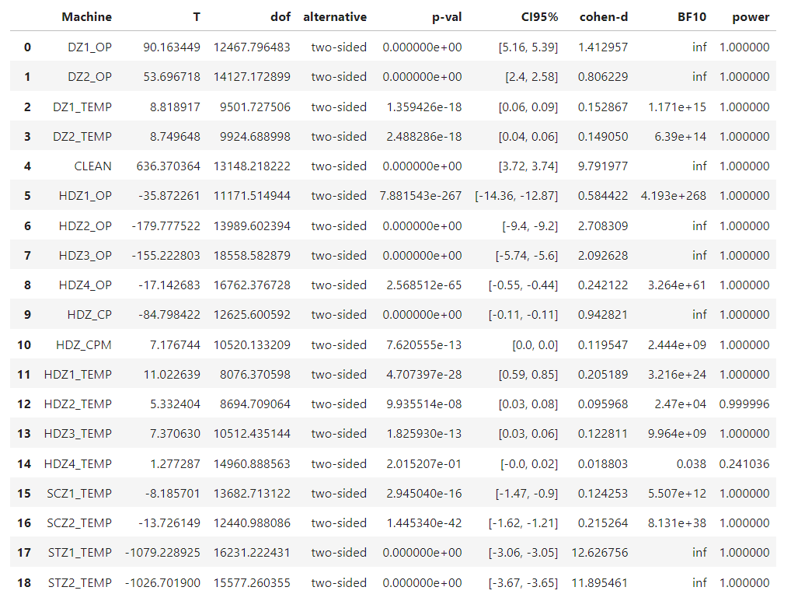

# Use Pingouin Library
```
import pingouin as pg

columns = df_104126.columns.tolist()
columns.remove('DZ1_OP')
```

> columns Output
```
['DZ2_OP',
 'DZ1_TEMP',
 'DZ2_TEMP',
 'CLEAN',
 'HDZ1_OP',
 'HDZ2_OP',
 'HDZ3_OP',
 'HDZ4_OP',
 'HDZ_CP',
 'HDZ_CPM',
 'HDZ1_TEMP',
 'HDZ2_TEMP',
 'HDZ3_TEMP',
 'HDZ4_TEMP',
 'SCZ1_TEMP',
 'SCZ2_TEMP',
 'STZ1_TEMP',
 'STZ2_TEMP']
```

```
statistic_1 = pg.ttest(df_104126['DZ1_OP'], df_128795['DZ1_OP'])
statistic_1.insert(0, 'Machine', 'DZ1_OP')

statistic_list = [statistic_1]

for column in columns:
    statistic_2 = pg.ttest(df_104126[column], df_128795[column])
    statistic_2.insert(0, 'Machine', column)
    statistic_list.append(statistic_2)

statistic_3 = pd.concat(statistic_list, ignore_index=True)
```
> statistic_3 Output
# T-Test 지표 테이블
