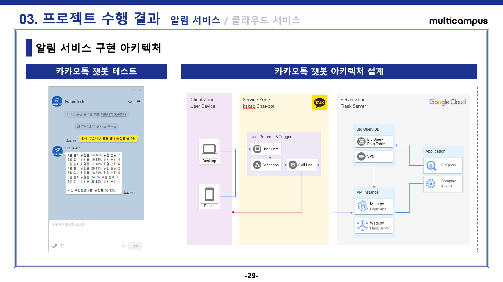
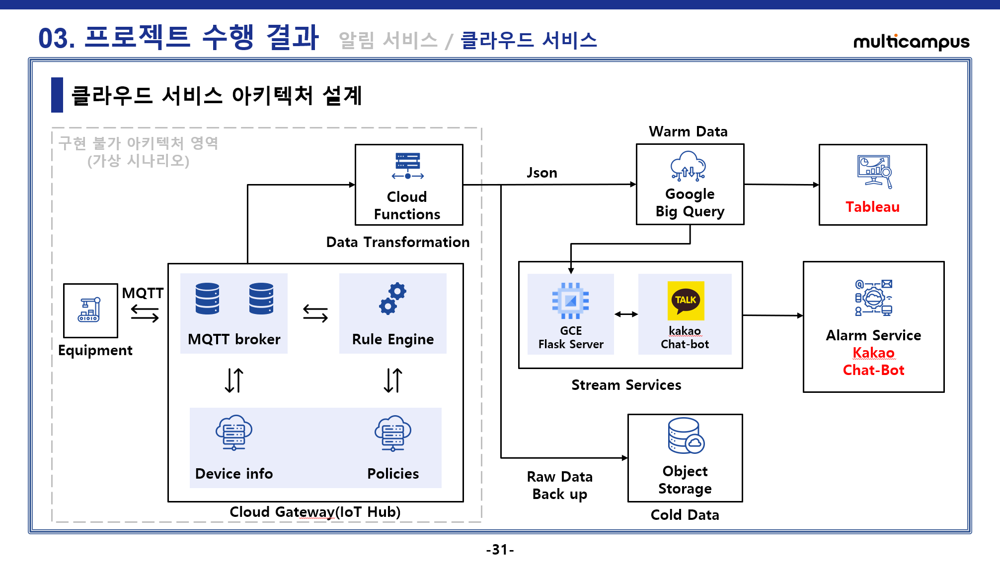

# Kamp-AI 인공지능 공모전

## 프로젝트 데이터 셋 : 열처리 뿌리금형

### 문제 정의
- 숙련공에 의존하는 작업 환경으로 작업자별 숙련도에 따른 생산 품질 변동
- 열처리 설비 공정 진행 시 육안으로는 확인하기 어렵다는 점
- 작업자의 문제인지 설비의 문제인지 정확히 알 수 없었다는 점

### 분석 기대효과
- 숙련도 의존 공정에서 데이터 기반 스마트 팩토리로 변동됨에 따른 품질 신뢰도 증가
- 고품질의 제품 제조가 수월해짐에 따른 손해 비용 최소화
- 설비의 이상 주기를 예측하여 예지보전을 통한 미래 손해 방지

### 데이터 처리 순서
1. 데이터 셋 결측치 및 데이터 타입 확인
2. 결측치 처리(평균값 대체 채택)
3. EDA 및 가설검정을 통해 인사이트 찾기
4. 예측 모델을 위한 파이프라인 구축
5. 품질보증 및 예지보전 예측모델 구현
6. 구글 빅쿼리에 태블로 연동하여 시각화 대시보드 구현
7. 구글 VM Instance에 Flask 서버 실행 및 카카오 비즈니스 챗봇과 연동하여 알림 서비스 구현

### Use Tools
- Preprocessing(전처리)
    + pandas
    + numpy
    + msno
- Visualization(시각화)
    + matplotlib
    + seaborn
    + tableau(public)
- Machine Learning & Deep Learning
    + Logistic Regression
    + Light GBM
    + XGBoost
    + RandomForest
    + Extra Trees
    + Gradient Boosting
    + GRU
    + LSTM
- Cloud Service
    + Google BigQuery
    + Google Compute Engine(VM Instance Flask Server)
    + Kakao Chat Bot(https://business.kakao.com/)

#### 데이터 처리 세부내용
```
▣ 데이터 1차 전처리
결측치는 Mean, Median, Back Fill, impyute Mice 기법을 사용하였으나
모델의 성능에 평균치로 대체하는 Mean 대체 기법이 가장 좋았으므로 평균치로 대체하였다.

▣ 데이터 EDA 시각화
EDA는 각 설비데이터에 대해 히스토그램, 박스 플롯을 시각화하여 참고하였으나
유의미한 정보를 파악하기 힘들어 PPT에는 생략 하였다.

▣ 데이터 가설검정
가설은 배정번호별 각 설비 데이터 평균값에 차이가 있을거라 생각했고,
불량률의 상하위 그룹에 차이가 명확할거라 가정했다.

불량률이 가장 높은 배정번호와 불량률이 발생하지 않은 배정번호 그룹간의
T-Test를 Pingouin 라이브러리로 진행하였고 아래 첨부한 지표대로 유의미한 차이를 확인하였다.

▣ 데이터 2차 전처리 및 예측 모델 구현
예측 모델을 구현하기 위해 파이프라인을 아래와 같이 진행하였다.
1. 설비 데이터 및 품질 데이터 결합
2. 종속변수를 만들기 위해 파생변수 생성(불량률, 불량률 Q3에 해당하는 상위그룹인 불량단계)
3. 불량단계 라벨인코더로 라벨링(이진분류 안전: 0, 위험: 1)
4. 파이프라인에 아래의 기법들을 담고 데이터셋을 훈련 데이터와 학습 데이터로 분리한다.
    오버샘플링(SMOTE), 정규화(Robust Scaler), 피처선택(RFECV), 교차검증(StratifiedKFold), 예측모델(XGBClassifier)
5. 예측 모델에 대한 성능 평가 및 결과를 해석한다.
    오버샘플링 기법을 통해 데이터의 불균형을 맞추고나니 재현율에서의 정확도가 높아졌다.
    품질에 대한 불량 검증 정확도가 높아졌으므로 유의미한 모델을 구현했다고 평가할 수 있다.
```
- - -
## Use Pingouin Library 통계 분석

> Import Pingouin
```
import pingouin as pg

columns = df_104126.columns.tolist()
columns.remove('DZ1_OP')
```

> columns Output
```
['DZ2_OP',
 'DZ1_TEMP',
 'DZ2_TEMP',
 'CLEAN',
 'HDZ1_OP',
 'HDZ2_OP',
 'HDZ3_OP',
 'HDZ4_OP',
 'HDZ_CP',
 'HDZ_CPM',
 'HDZ1_TEMP',
 'HDZ2_TEMP',
 'HDZ3_TEMP',
 'HDZ4_TEMP',
 'SCZ1_TEMP',
 'SCZ2_TEMP',
 'STZ1_TEMP',
 'STZ2_TEMP']
```

> T-Test Code
```
statistic_1 = pg.ttest(df_104126['DZ1_OP'], df_128795['DZ1_OP'])
statistic_1.insert(0, 'Machine', 'DZ1_OP')

statistic_list = [statistic_1]

for column in columns:
    statistic_2 = pg.ttest(df_104126[column], df_128795[column])
    statistic_2.insert(0, 'Machine', column)
    statistic_list.append(statistic_2)

statistic_3 = pd.concat(statistic_list, ignore_index=True)
```
- - -
### T-Test 테이블
```
통계지표 개념정리
Pingouin Library: https://pingouin-stats.org/build/html/generated/pingouin.ttest.html
t test 시 알아서 등분산 이분산에 맞는 검정으로 진행

1. T: t-검정 통계량입니다. 이 값은 두 그룹 간 평균의 차이가 표준오차로 나눈 값입니다.
절대값이 크면 클수록, 두 그룹 간의 차이가 더 유의미하다는 것을 의미합니다.

2. dof (Degrees of Freedom): 자유도를 나타냅니다.
이는 표본 크기와 변수의 개수에 따라 결정됩니다.

3. alternative: 검정이 양측 검정(two-sided)인지를 나타냅니다.
이는 두 그룹 간의 차이가 양의 방향이든 음의 방향이든 상관없이 차이가 있는지를 검정합니다.

4. p-val (P-Value): 귀무가설 하에서 관측된 결과가 나타날 확률입니다.
일반적으로 p-value가 0.05 또는 0.01 이하일 때, 결과를 통계적으로 유의미하다고 판단합니다.

5. CI95% (95% Confidence Interval): 평균 차이의 95% 신뢰 구간입니다.
이 구간에 0.05라도 포함하지 않으면, 평균 차이가 통계적으로 유의미하다고 할 수 있습니다.

6. cohen-d: 효과 크기(effect size)를 나타내는 지표로,
두 그룹 간의 차이가 얼마나 의미 있는지를 나타냅니다. 값이 클수록 효과 크기가 크다는 것을 의미합니다.

7. BF10: 베이지안 팩터로, 귀무가설 대비 대립가설의 지지 정도를 나타냅니다.
일반적으로 이 값이 3 이상이면 대립가설을 지지한다고 해석합니다.

8. power: 검정의 통계적 검정력을 나타냅니다.
1에 가까울수록 높은 검정력을 가지며, 일반적으로 0.8 이상이면 적절한 검정력을 가진 것으로 간주합니다.

해석:

1. 모든 변수에서 p-value가 매우 낮거나 0입니다.
이는 두 데이터셋 간에 각 변수에 대해 통계적으로 유의미한 차이가 있다는 것을 의미합니다.

2. 'T' 값이 양수인 경우 df_104126의 평균이 df_128795보다 높았음을, 음수인 경우는 반대임을 나타냅니다.

3. Cohen-d 값은 효과 크기를 나타내며, 값이 클수록 두 그룹 간의 차이가 더 크다는 것을 의미합니다.
예를 들어, 'CLEAN' 변수에서의 Cohen-d 값은 9.791977로, 매우 큰 효과 크기를 나타냅니다.

4. 검정력(power)이 대부분의 경우 1에 가까우므로, 이 검정들은 높은 검정력을 가진다고 할 수 있습니다.
```


- - -

## GCP Flask Server
- 서버 활성화 명령어 : gunicorn --bind 0.0.0.0:5000 wsgi:app
- 응답 메시지: 클라이언트 <-> 카카오톡 챗봇 <-> 서버 API 로직





## Tableau DashBoard
- [Tableau DashBoard Link](https://public.tableau.com/app/profile/.16816636/viz/AI_Final_Tableau_17017392316660/sheet6?publish=yes)